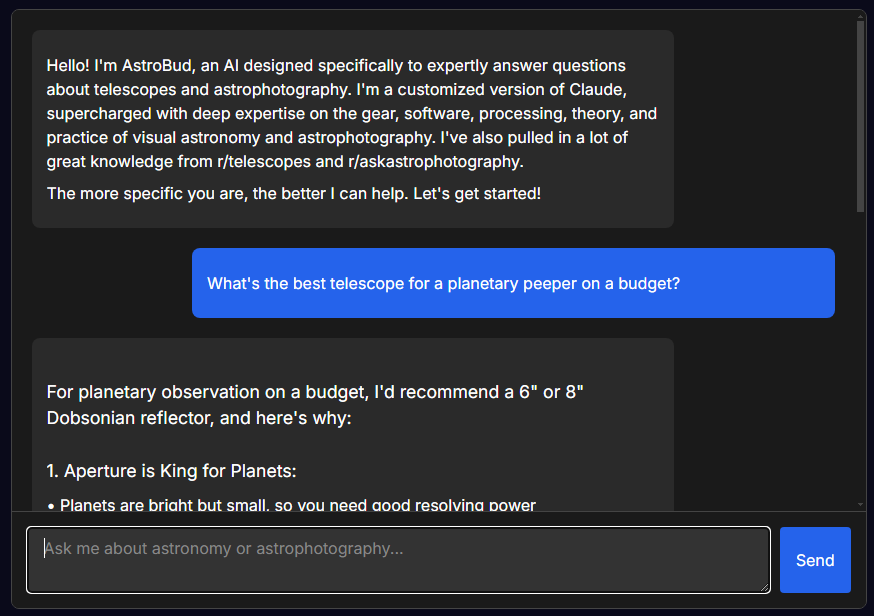

# JGChat - Claude AI Chatbot for WordPress

JGChat is a lightweight yet powerful WordPress plugin that adds a customizable AI chatbot powered by Anthropic's Claude AI to your website.



## Features

- 🤖 **Claude AI Integration**: Powered by Anthropic's state-of-the-art Claude AI models
- 🎨 **Fully Customizable**: Dark-themed interface that matches the JG Widget Style Guide
- 📱 **Responsive Design**: Works seamlessly on desktop and mobile devices
- 💬 **Dual Implementation**: Use as a floating widget or embed directly in page content
- 📚 **Knowledge Base**: Feed your chatbot custom information to provide tailored responses
- 📊 **Question Logging**: Track what users are asking with built-in logging and CSV export
- 🔄 **Chat History**: Maintains conversation context for natural dialogue
- 🎭 **Model Selection**: Choose from Claude 3.5 or Claude 3 models to balance capability and cost

## Installation

### Method 1: Direct Upload

1. Download the latest release from [GitHub Releases](https://github.com/yourusername/jgchat/releases)
2. Upload the plugin folder to your `/wp-content/plugins/` directory
3. Activate the plugin through the 'Plugins' menu in WordPress
4. Configure your settings at `WP Admin > JGChat > Settings`

### Method 2: WordPress Plugin Directory

*Coming soon*

## Configuration

### Required Setup

1. Create an account at [Anthropic Console](https://console.anthropic.com/) and get your API key
2. Go to `WordPress Admin > JGChat > Settings`
3. Enter your Anthropic API key
4. Select your preferred Claude model
5. Set your chatbot name, welcome message, and input placeholder text
6. Add any specific knowledge to the Knowledge Base text area
7. Save your settings

## Usage

### As a Widget

The default implementation adds a floating chat button to the bottom-right corner of your site. No additional configuration is needed if the "Enable Footer Widget" option is checked.

### As an Embedded Chat

Add the chat interface directly to any page or post content:

```
[jgchat]
```

## Styling

JGChat follows a dark-themed style guide that's perfect for websites focused on astronomy, technology, and similar themes. The interface is designed to be clean, professional, and user-friendly.

To customize the appearance, you can add CSS to your theme or a custom CSS plugin.

## Admin Features

### Discussion Log

Track what your users are asking:

1. Go to `WordPress Admin > JGChat > Discussion Log`
2. View all chat questions chronologically
3. Search for specific queries
4. Export the full log as a CSV file

## Development

### Prerequisites

- WordPress 5.6+
- PHP 7.4+
- Anthropic API key

### Local Development

1. Clone this repository
2. Set up a local WordPress development environment
3. Symlink or copy the plugin to your local plugins directory
4. Activate the plugin and configure as described above

## License

This project is licensed under the GPL v2 or later - see the [LICENSE](LICENSE) file for details.

## Credits

- Developed by [jaglab](https://github.com/yourusername)
- Powered by [Anthropic's Claude AI](https://www.anthropic.com/)

## Support

For bugs or feature requests, please [open an issue](https://github.com/yourusername/jgchat/issues).